# Allison Peña Montejo

# Fundamentos de álgebra

# Ejercicio #5
---

## Registro de los ejercicios

Los ejercicios deben estar bien resueltos y con los pasos explicados.

**Ubica los siguientes números complejos en el plano**

**Resuelve las siguientes operaciones con los números complejos**

**(25)** ($-7-4i$) - ($2+i$) = $-9-5i$

      Re |  Im
      -7 | -4
      -2 | -1i
      --------
      -9 | -5i

**(26)** ($2-4i$) - ($5-3i$) = $-3-1i$

      Re |  Im
       2 | -4i
      -5 | -3i
      --------
      -3 | -1i

**(27)** ($7-8i$) - ($3i$)-7 = $-11i$

      Re |  Im
       7 | -8i
       7 | -3i
      --------
       0 | -11i

**(28)** ($1+5i$) + ($-8-5i$)+3 = $-4$

      Re |  Im
       1 |  5i
      -8 | -5i
       3 | -3i
      --------
      -4 | 0i

**(29)** $-8-($3-5i$) + ($4+8i$) = $-7+13i$

      Re |  Im
      -8 | 5i
      -3 | 8i
       4 | 
      --------
      -7 | -13i

**(30)** ($-4+2i$) + ($3i) + ($-4-7i$) = $-8-2i$

      Re |  Im
      -4 | 2i
      -4 | 3i
         | -7i
      --------
      -8 | -2i

**(31)** ($2i$)($-4i$) = $8$
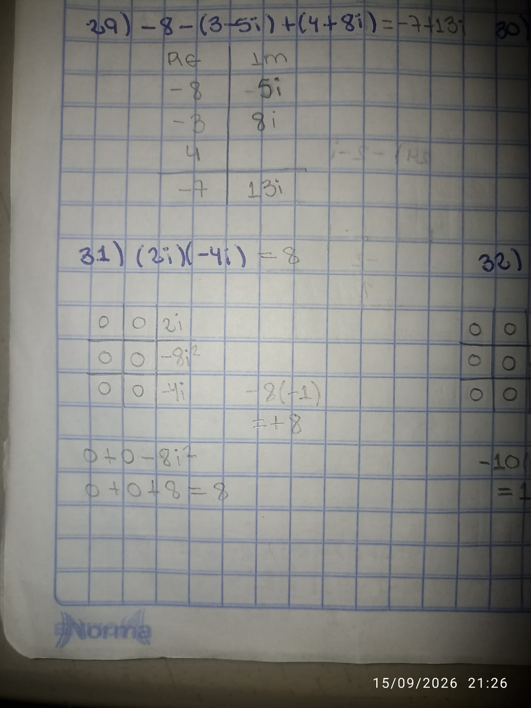      
   

**(32)** ($-2i$)($5i$) * 6 = $-60$
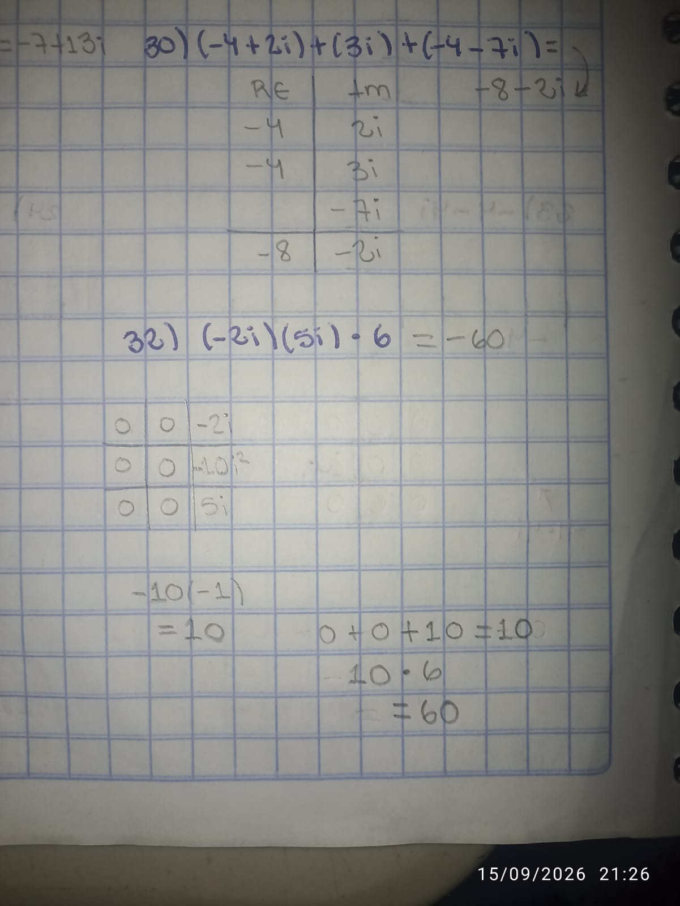

      
**(33)** (-7i)(8+8i)(-2-8i) = -560 - 336i
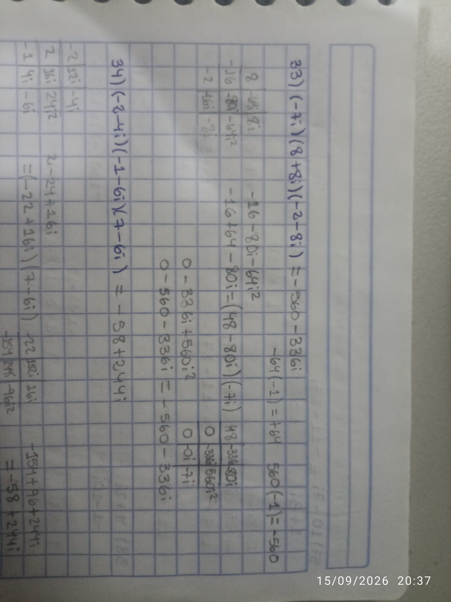

**(34)** (-2-4i)(-1-6i)(7-6i) = -58+244i
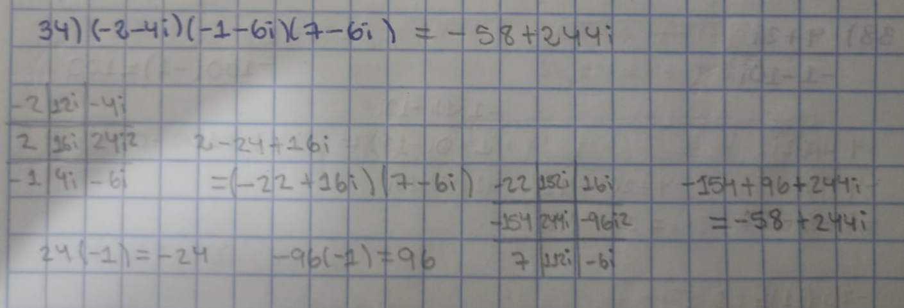

**(35)** (3i)(1-7i)(7+4i) = 135+105i
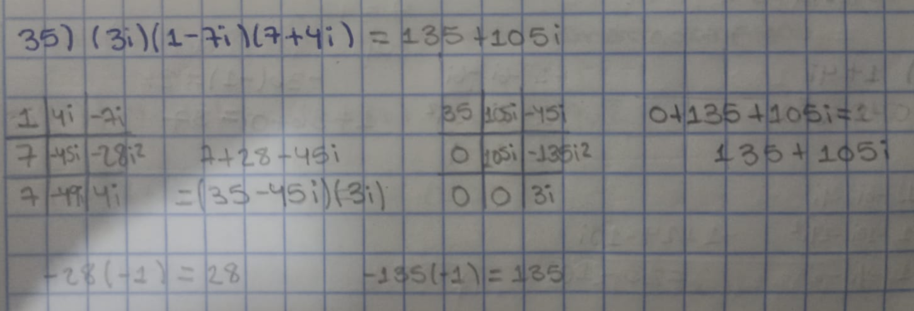

**(36)** (-6)(-5+i)(6-2i) = 96+168i
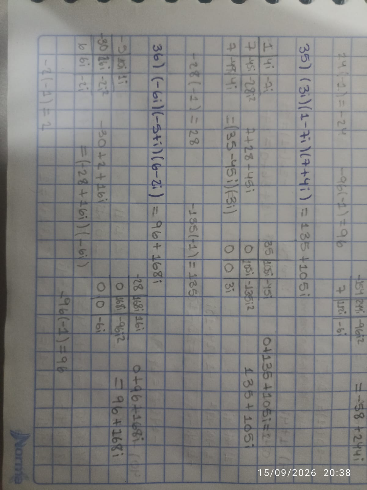

**(37)** 10-7i/1+3i = -11-37i/10
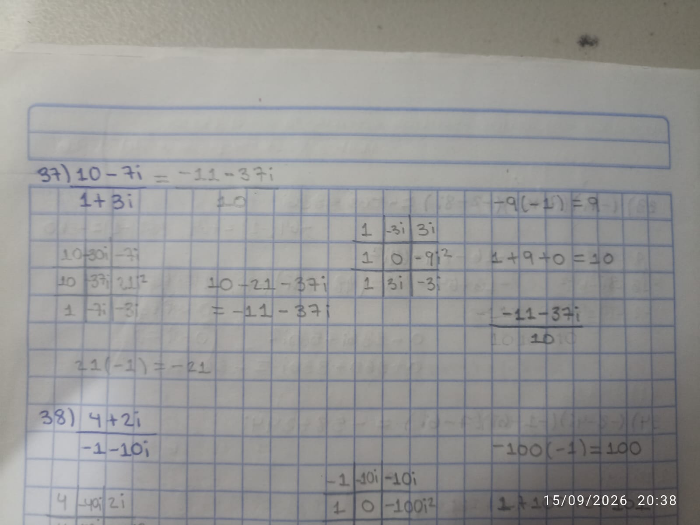

**(38)** 4+2i/-1-10i = -24+38i/101 
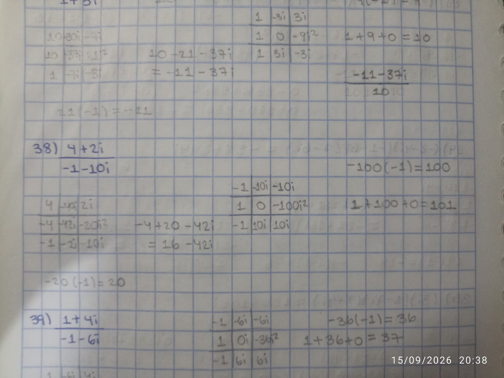

**(39)** 1+4i/-1-6i = -25+2i/37
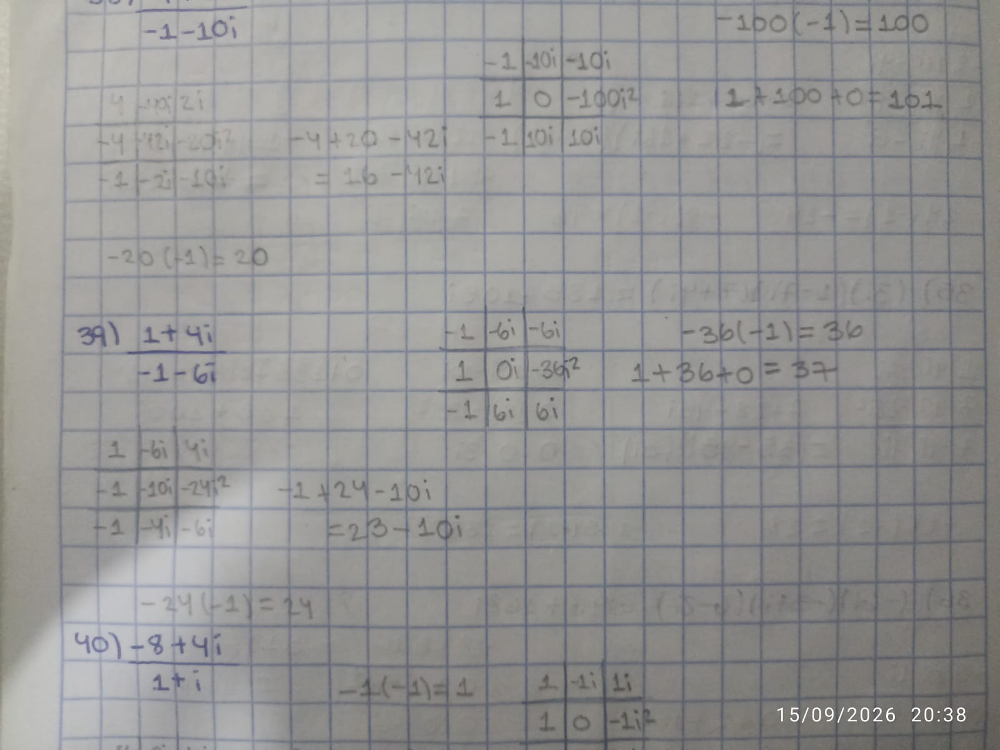

**(40)** -8+4i/1+i = -2+6i
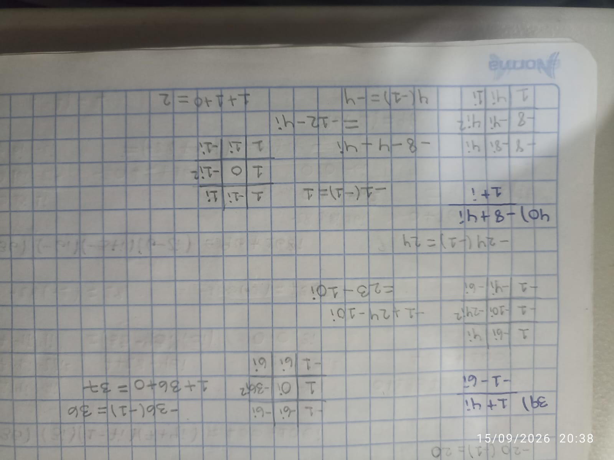

**(41)** -10+8i/6+i = -52+58i/37
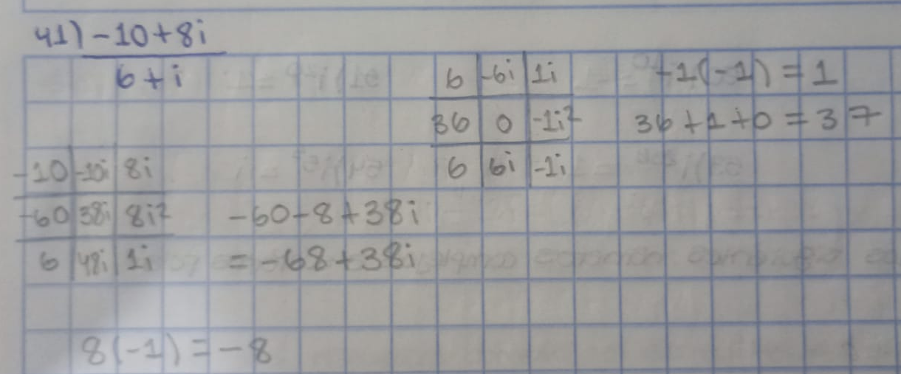

**(42)** 2-2i/4-10i = 7+3i/29
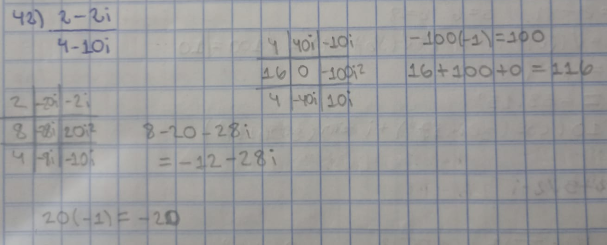

**Calcula el valor absoluto de los siguientes números complejos**

**(43)** |-9-9i| = √(81+81) = √162 = 9√2

**(44)** |8-6i| = √(64+36) = √100 = 10

**(45)** |6-3i| = √(36+9) = √45 = 3√5

**(46)** |10+10i| = √(100+100) = √200 = 10√2

**(47)** √(36+100) = √136 = 2√34

**(48)** |-1+7i| = √(1+49) = √50 = 5√2

**Resuelve las siguientes potencias de i**

**(49)** i^5 = i

**(50)** i^10 = -1

**(51)** i^20 = 1

**(52)** i^35 = -i

**(53)** i^256 = 1

**(54)** i^5 = i

**Convierte los siguientes números complejos a su forma polar**

**(55)** 6-8i

z= 6-8i   a=6    b=-8
r= √((6)^2 + (-8)^2) = √(36+64) = √100 = √10
⊖= tan-1 (-8/6)
⊖ = -53.13°

10 (cos (306.87°) + i sin (306.87°))

**(56)** 5√2+5√2*i

r= √((5√2)^2 + (5√2)^2
= √50+50
= √100
= √10
⊖ = 45°

10 (cos45° + i sin 45°)

**(57)** 2-2√3*i

r= √(2)² + (-2√3)² = √(4+12) = 4
⊖ = -60°  

4(cos(-60°)+ i sin(-60°))

**(58)** 3√3/2 - 3i/2

3√3/2 - 3/2i   r=√27/4+9/4 = √36 = 3
⊖ = -30°   

3(cos(-30)+i sin(-30°))

**(59)** -2

r=2
⊖=180°   

2(cos180° + i sin180°)

**(60)** -7i

r=7
⊖=270°  

7(cos270° + i sin270°)

**(61) cos 30 + i sin 30**

cos 30° = √3/2  sin30° = 1/2 = √3/2 + 1/2i

**(62) 2 (cos 60 + i sin 60)**

2(1/2 + √3/2 i) = 1 + √3i

**(63) 1.5 (cos90 + i sin 90)**

cos 90° = 0

sin 90° = 1

= 1.5 (0+i) = 1.5i

**(64) 2.5 (cos 120 + i sin 120)**

cos 120° = - 1/2   sin 120° = √3/2

= -1.25 + 5√3/4 i

= 2.5 (- 1/2 + √3/2 i)

**(65) 4 (cos 135 + i sin 135)**

cos 135° = - √2/2  sin 135° = √2/2

= 4 (- √2/2 + √2/2 i)  -2√2 + 2√2i

**(66) 3(cos 180 + i sin 180)**

= 3(-1 + 0i)

= -3

**(67) 2 raíces cuadradas de 4 (cos30+i sin30)**

k=0  2(cos15°+ i sin15°)

k=1  2(cos 195° + i sin195°)

**(68) 2 raíces cuadradas 3 (cos90+i sin90)**

k=0  1.732(cos45° + i sin45°)

k=1 1.732(cos225° + i sin225°)

**(69) 3 raíces cúbicas de -4√2 + 4i√2**

k=0  2(cos45° + i sin45°)

k=1 2(cos165° + i sin165°)

k=2 2(cos285° + i sin285°)

**(70) 3 raíces cúbicas de -27/8**

k=0  1.5(cos60° + i sin60°)

k=1  1.5(cos180° + i sin180°)

k=2  1.5(cos300° + i sin300°)

**(71) 5 raíces de -32i**

k=0 2(cos342° + i sin342°)

k=1 2(cos54° + i sin54

k=2 2(cos126° + i sin126°)

k=3 2(cos198° + i sin198°)

k=4 2(cos270° + i sin270°)

**(72) 6 raíces de 729**

k=0 3(cos0° + i sin0°)

k=1 3(cos60° + i sin60°)

k=2 3(cos120° + i sin120°)

k=3 3(cos180° + i sin180°)

k=4 3(cos240° + i sin240°)

k=5 3(cos300° + i sin300°)
