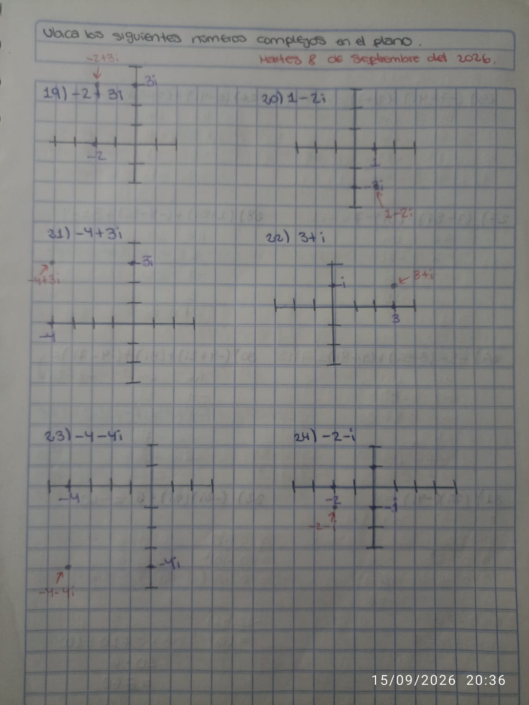

# Allison Peña Montejo

# Fundamentos de álgebra

# Ejercicio #5
---

## Registro de los ejercicios

Los ejercicios deben estar bien resueltos y con los pasos explicados.

**Ubica los siguientes números complejos en el plano**

